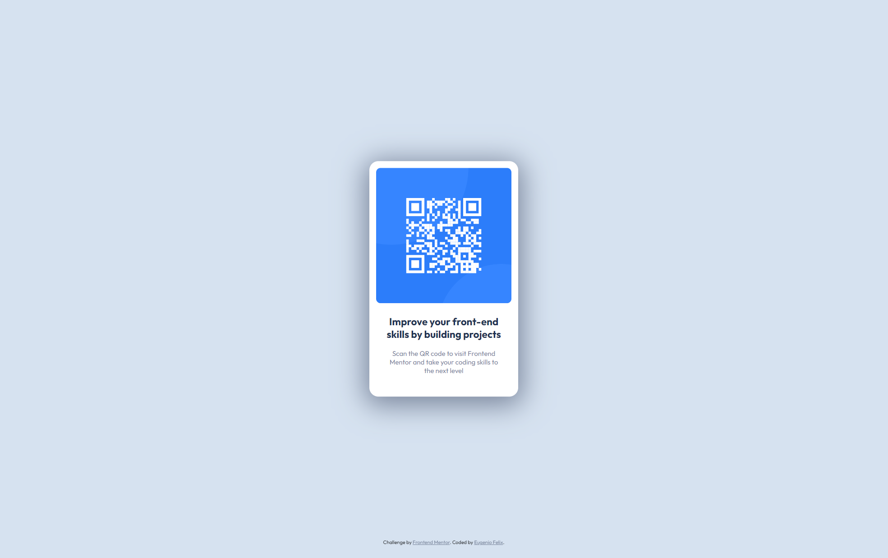

# Frontend Mentor - QR Code Component Solution 

## Table of contents

- [Overview](#overview)
  - [Screenshot](#screenshot)
  - [Links](#links)
- [My process](#my-process)
  - [Built with](#built-with)
  - [Useful resources](#useful-resources)
- [Author](#author)

### Overview

This is a solution to the [QR code component challenge on Frontend Mentor](https://www.frontendmentor.io/challenges/qr-code-component-iux_sIO_H). Frontend Mentor challenges help you improve your coding skills by building realistic projects.

### Screenshot

### Links

- Live Site URL: [Add live site URL here](https://efeli24.github.io/frontend-mentor-qr-component/)

### Built with

- HTML and CSS

### Useful resources

- [11 Ways to Center Div or Text in Div in CSS](https://blog.hubspot.com/website/center-div-css) - This was a big help when I couldn;t figure out how to align the div with the QR code in the middle instead of aligning starting at the edge of the div.
- [W3 Schools](https://www.w3schools.com/) - Great as a refresher for a few elements and attributes.

## Author

- Website - [Eugenio Felix](https://eugeniofelix.com/)
- Frontend Mentor - [@efeli24](https://www.frontendmentor.io/profile/efeli24)
